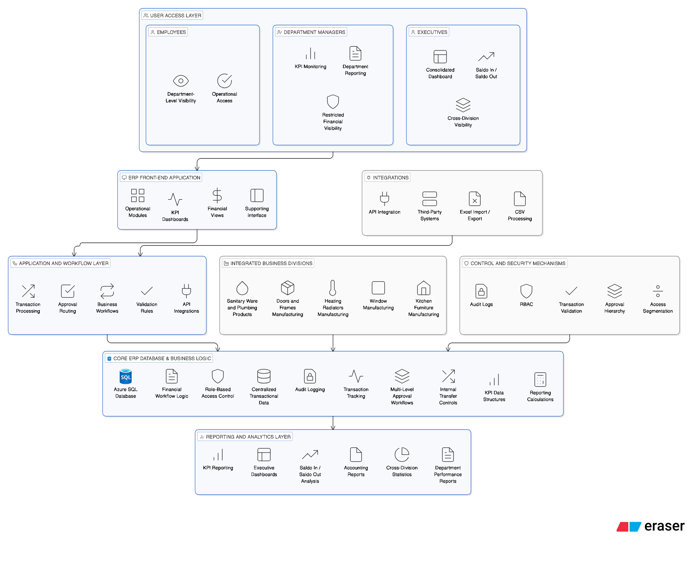

# B2B Marketplace Platform

Enterprise-scale B2B marketplace platform built initially for the plumbing and industrial supply sector across Central Asia, with architecture designed for future expansion into additional product categories.

## Overview
The platform was designed to support large-scale procurement, inventory visibility, fulfillment, and delivery coordination across multiple cities, warehouses, and operational regions.

After launch, the marketplace supported:
- 5,000+ business partners / supplier entities
- 50,000+ in-stock products
- web and mobile commerce flows
- QR-based delivery tracking
- KPI and incentive programs for operational teams

The solution was designed not only for plumbing products, but also for future expansion into categories such as home appliances, office equipment, and furniture.

## Platform Channels
- Web Marketplace
- iOS Mobile Application
- Android Mobile Application
- Admin / Operations Dashboard

## Key Features
- AI-powered product image search
- Multi-language support
- Product catalog and category navigation
- Regional warehouse fulfillment logic
- Courier dispatch integration
- GPS-based delivery tracking
- KPI and incentive tracking for employees
- Sales and operational analytics

  ## Scale Highlights
- 5,000+ onboarded business entities / partners after launch
- 50,000+ active in-stock products
- Multi-city warehouse and fulfillment coverage
- Web, iOS, and Android platform support
- Designed for future multi-category marketplace expansion

## Business Context
The platform was created for a major industrial / plumbing distribution business with manufacturing facilities, warehouses, and delivery coverage across multiple cities and regions in Central Asia.

## My Contribution
- Designed marketplace data architecture
- Participated in business workflow design
- Built inventory and fulfillment logic
- Contributed to KPI / incentive calculation logic
- Supported reporting and analytics architecture
- Worked on operational data flows and integrations

## Development Preview
Dev environment available for demonstration:

`dev.theremont.uz`

## Documentation
- [Architecture](./architecture.md)
- [Business Rules](./business-rules.md)
- [Database Schema](./database-schema.md)
- [Integration Flow](./integration-flow.md)
- [KPI Engine](./kpi-engine.md)
